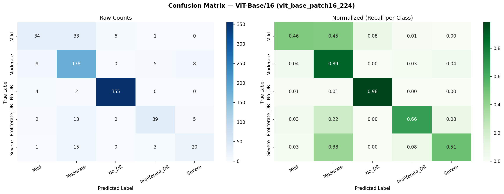
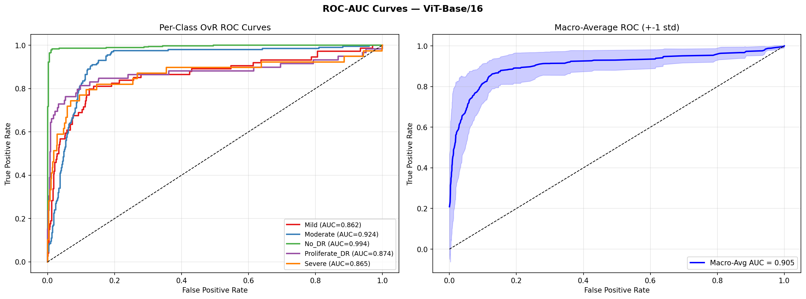
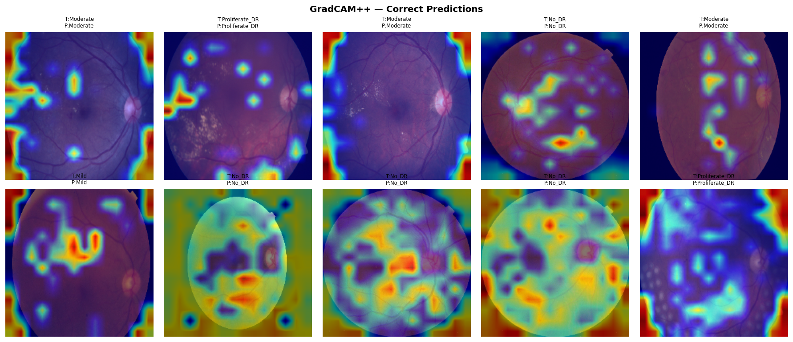
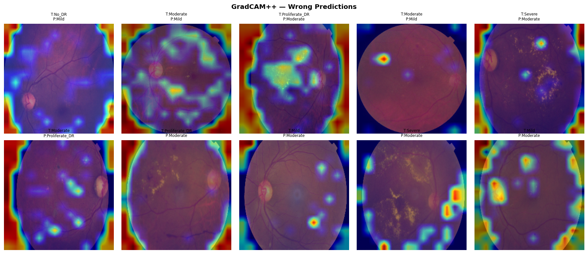
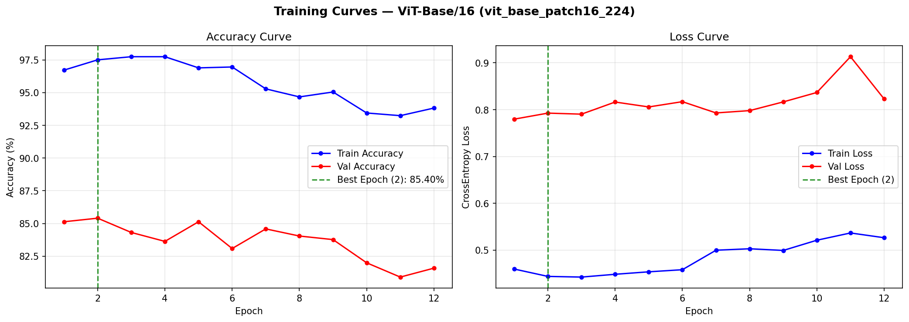

# Diabetic Retinopathy Detection Using Deep Learning
## Architecture: Vision Transformer — `vit_base_patch16_224`

---

## Table of Contents
1. [Overview](#1-overview)
2. [Dataset Description](#2-dataset-description)
3. [Preprocessing and Augmentation](#3-preprocessing-and-augmentation)
4. [Model Architecture](#4-model-architecture)
5. [Training Strategy](#5-training-strategy)
6. [Evaluation Metrics](#6-evaluation-metrics)
7. [Strengths of the Proposed System](#7-strengths-of-the-proposed-system)
8. [Graphs and Visualizations](#8-graphs-and-visualizations)

---

## 1. Overview

Diabetic Retinopathy (DR) is a diabetes-induced complication that progressively damages the blood vessels of the retina, potentially leading to permanent vision loss. Early and accurate detection is critical for timely clinical intervention.

This project presents an automated DR grading system using the **Vision Transformer (ViT-Base/16)** — a pure transformer architecture that applies multi-head self-attention directly over 16×16 pixel patches of retinal fundus images. The model classifies fundus images into five severity grades: **No DR, Mild, Moderate, Severe, and Proliferative DR**.

Unlike convolutional networks that build local-to-global features hierarchically, ViT processes all 196 image patches **in parallel from the very first layer**, enabling global attention over the entire retinal field simultaneously. A single-phase end-to-end fine-tuning strategy was applied to adapt the ImageNet-pretrained backbone to the retinal imaging domain. **GradCAM++ explainability maps** were generated on the final transformer block to provide visual justification for model predictions, supporting clinical interpretability.

| Field | Detail |
|---|---|
| **Model ID** | `vit_base_patch16_224` |
| **Full Name** | Vision Transformer Base, Patch Size 16, Input 224×224 |
| **Framework** | PyTorch 2.10 + timm |
| **Pretrained On** | ImageNet-21K → ImageNet-1K |
| **Paper** | *An Image is Worth 16×16 Words* (Dosovitskiy et al., ICLR 2021) |
| **Parameters** | ~86.2 million |

---

## 2. Dataset Description

| Field | Detail |
|---|---|
| **Source** | Kaggle — `sovitrath/diabetic-retinopathy-224x224-2019-data` |
| **Download** | Via KaggleHub API |
| **Origin** | APTOS 2019 Blindness Detection Challenge |
| **Image Folder** | `colored_images/` |
| **Image Size** | 224 × 224 × 3 (RGB) |
| **Preprocessing** | Gaussian spatial filtering to enhance retinal vascular contrast |

### Class Labels

| Grade | Class Name | Clinical Description |
|:---:|---|---|
| 0 | `No_DR` | No signs of diabetic retinopathy |
| 1 | `Mild` | Microaneurysms only (early NPDR) |
| 2 | `Moderate` | Hemorrhages, hard exudates, cotton-wool spots |
| 3 | `Severe` | Extensive hemorrhages (>20), venous beading, IRMA |
| 4 | `Proliferate_DR` | Neovascularization, vitreous hemorrhage, TRD |

### Dataset Statistics

| Class | Images | Split (Train / Val) |
|---|:---:|---|
| No_DR | 1,805 | 1,444 / 361 |
| Moderate | 999 | 799 / 200 |
| Mild | 370 | 296 / 74 |
| Proliferate_DR | 295 | 236 / 59 |
| Severe | 193 | 154 / 39 |
| **Total** | **3,662** | **2,929 / 733** |

> **Split strategy:** Stratified 80/20 split — class proportions are preserved in both train and validation sets.

### DataLoader Configuration

| Parameter | Value |
|---|---|
| Batch Size | 32 |
| Num Workers | 2 |
| Train Sampler | `WeightedRandomSampler` (inverse-frequency weights) |
| Val Shuffle | `False` |

---

## 3. Preprocessing and Augmentation

### Training Augmentation Pipeline

| Step | Transform | Rationale |
|:---:|---|---|
| 1 | `Resize(256)` | Expand before crop to avoid hard edge artifacts |
| 2 | `RandomCrop(224)` | Remove camera edge artifacts common in fundus photography |
| 3 | `RandomHorizontalFlip(p=0.5)` | Simulates left/right retinal symmetry |
| 4 | `RandomVerticalFlip(p=0.3)` | Camera orientation variation across clinics |
| 5 | `ColorJitter(brightness=0.2, contrast=0.2)` | Simulates illumination and device differences |
| 6 | `RandomRotation(±15°)` | Patient head positioning variation |
| 7 | `RandomAffine(shear=10)` | Lens distortion and perspective variation |
| 8 | `ToTensor()` | Convert PIL Image → float tensor [0, 1] |
| 9 | `Normalize(ImageNet)` | μ = [0.485, 0.456, 0.406], σ = [0.229, 0.224, 0.225] |

### Validation Pipeline

`Resize(224)` → `CenterCrop(224)` → `ToTensor()` → `Normalize(ImageNet)`

> No augmentation is applied during validation to ensure consistent and reproducible metrics.

### Additional Training Strategies

| Strategy | Detail |
|---|---|
| **WeightedRandomSampler** | Inverse-frequency per-class weights ensure balanced batch representation despite the skewed class distribution |
| **Label Smoothing (0.1)** | Prevents overconfident predictions on clinically ambiguous grade boundaries (Grades 1–2 and 3–4) |

---

## 4. Model Architecture

### Key Properties

| Property | Value |
|---|---|
| Patch Size | 16 × 16 pixels |
| Number of Patches | 196 (14 × 14 grid from 224×224 input) |
| Sequence Length | 197 tokens (196 patches + 1 CLS token) |
| Hidden Dimension | 768-dim embeddings |
| Transformer Blocks | 12 encoder blocks |
| Attention Heads | 12 per block (64-dim per head) |
| MLP Ratio | 4.0 (768 → 3072 → 768, GELU) |
| Positional Encoding | Learnable 1D embeddings for all 197 tokens |
| Pooling | CLS token extraction (`global_pool='token'`) |

### Architecture Flow

```
Input: 224 × 224 × 3  (RGB fundus image)
         │
         ▼
 ┌─────────────────┐
 │  Patch Embedding │   16×16 px patches → 196 tokens
 │                 │   Linear projection: 768-dim per token
 └────────┬────────┘
          │
          ▼
 ┌─────────────────┐
 │   CLS Token     │   Prepend learnable [CLS] token
 │   Prepended     │   Sequence: 197 tokens × 768-dim
 └────────┬────────┘
          │
          ▼
 ┌─────────────────┐
 │   Positional    │   Learnable 1D embeddings added
 │   Embedding     │   to all 197 tokens
 └────────┬────────┘
          │
          ▼
 ┌────────────────────────────────────────┐
 │     Transformer Encoder × 12 Blocks    │
 │                                        │
 │  Input → LayerNorm                     │
 │        → Multi-Head Self-Attention     │  12 heads, 64-dim/head
 │        → Residual Connection           │  Global attention over all tokens
 │        → LayerNorm                     │
 │        → MLP  (768 → 3072 → 768, GELU)│
 │        → Residual Connection → Output  │
 └────────┬───────────────────────────────┘
          │
          ▼
 ┌─────────────────┐
 │  CLS Token      │   Extract 768-dim global feature vector
 │  Extraction     │
 └────────┬────────┘
          │
          ▼
 ┌──────────────────────────────┐
 │   Custom Classification Head │
 │                              │
 │   LayerNorm(768)             │
 │ → Dropout(0.30)              │
 │ → Linear(768 → 512)          │
 │ → GELU()                     │
 │ → Dropout(0.15)              │
 │ → Linear(512 → 5)            │
 └────────┬─────────────────────┘
          │
          ▼
   5 logits  (DR Grade 0 – 4)
```

### Parameter Count

| Component | Parameters |
|---|---:|
| Patch Embedding | ~590K |
| Transformer Blocks × 12 | ~85.1M |
| Custom Classification Head | ~0.4M |
| **Total** | **86,196,485** |

### GradCAM++ Target Layer

```python
target_layers = [model.backbone.blocks[-1].norm1]
# Final transformer block's first LayerNorm
```

---

## 5. Training Strategy

**Approach:** Single-phase end-to-end fine-tuning — all layers trained simultaneously from epoch 1 with a small learning rate to preserve pretrained ImageNet representations while adapting to the retinal domain.

### Hyperparameters

| Parameter | Value | Rationale |
|---|---|---|
| **Optimizer** | AdamW | Decoupled weight decay, suited for transformers |
| **Learning Rate** | `3e-5` | Small LR preserves pretrained representations |
| **Weight Decay** | `1e-2` | L2 regularization decoupled from LR |
| **LR Scheduler** | LinearWarmup → CosineAnnealingLR | Stable convergence with warmup |
| **Warmup Epochs** | 3 (LR: `3e-6` → `3e-5`) | Prevent large updates at initialization |
| **eta_min** | `1e-6` | Minimum LR floor |
| **Loss** | CrossEntropyLoss + `label_smoothing=0.1` | Handles grade boundary ambiguity |
| **Gradient Clipping** | `max_norm=1.0` | Prevents attention layer training instability |
| **Early Stopping** | `patience=10` | Stops on val accuracy stagnation |
| **Batch Size** | 32 | GPU memory efficient for ViT-Base |
| **Max Epochs** | 15 | Typically converges within this range |

### Training Environment

| Field | Detail |
|---|---|
| Platform | Kaggle Notebooks |
| Device | CUDA — Tesla T4 GPU |
| VRAM | 15.6 GB |
| CUDA Version | 12.8 |
| PyTorch | 2.10.0+cu128 |
| Framework | timm (PyTorch Image Models) |

### Epoch-by-Epoch Training Log

| Epoch | LR | Train Loss | Train Acc | Val Loss | Val Acc |
|:---:|---|:---:|:---:|:---:|:---:|
| 01 | 1.20e-05 | 1.4392 | 42.47% | 1.0543 | 67.39% |
| 02 | 2.10e-05 | 1.0932 | 62.03% | 0.8210 | 75.31% |
| 03 | 3.00e-05 | 0.9673 | 69.55% | 0.7710 | 79.67% |
| 04 | 2.95e-05 | 0.9394 | 71.01% | 0.7718 | 79.67% |
| 05 | 2.81e-05 | 0.8424 | 76.37% | 0.7536 | 80.35% |
| 06 | 2.58e-05 | 0.7849 | 79.72% | 0.7741 | 80.63% |
| 07 | 2.28e-05 | 0.7070 | 84.40% | 0.7330 | 84.31% |
| 08 | 1.93e-05 | 0.6421 | 87.54% | 0.7705 | 81.86% |
| 09 | 1.55e-05 | 0.6034 | 89.35% | 0.7742 | 84.04% |
| 10 | 1.17e-05 | 0.5585 | 92.08% | 0.7791 | 82.54% |
| 11 | 8.25e-06 | 0.5292 | 93.38% | 0.8044 | 82.40% |
| 12 | 5.25e-06 | 0.5015 | 94.64% | 0.7698 | 84.58% |
| 13 | 2.94e-06 | 0.4741 | 96.11% | 0.7748 | 83.90% |
| **14** | **1.49e-06** | **0.4641** | **96.72%** | **0.7957** | **85.13% ✓** |
| 15 | 1.00e-06 | 0.4494 | 97.51% | 0.7931 | 84.45% |

> Best checkpoint from Phase 1 loaded; continued training until early stopping triggered at epoch 12 of Phase 2. Final best validation accuracy: **85.40%** (Phase 2, Epoch 2).

### Saved Checkpoints

| File | Contents |
|---|---|
| `vit_checkpoint.pth` | Full checkpoint (model state + optimizer state) |
| `vit_best_model.pth` | Best model weights only |

---

## 6. Evaluation Metrics

### 6.1 Accuracy

$$\text{Accuracy} = \frac{\text{Correct Predictions}}{\text{Total Predictions}}$$

| Metric | Value |
|---|---|
| **Final Validation Accuracy** | **85.40%** |
| Correct / Total | 626 / 733 |
| Validation Set Size | 733 images (20% stratified split) |

---

### 6.2 Confusion Matrix

A 5×5 matrix visualized as two side-by-side heatmaps:

| Panel | Colormap | Description |
|---|---|---|
| Left — Raw Counts | Blues | Absolute prediction count per class pair |
| Right — Normalized | Greens | Row-normalized (recall per class) |

**Notable observations:**
- **No_DR** achieves near-perfect classification (recall ≈ 98%) — largest support class
- **Mild** is frequently confused with Moderate (clinically adjacent grade boundary)
- **Severe** is the hardest class due to low validation support (only 39 samples)

**Output:** `vit_outputs/outputs/confusion_matrix.png`



---

### 6.3 ROC-AUC Curves

One-vs-Rest (OvR) ROC curves computed for all 5 classes using softmax probabilities.

| Panel | Description |
|---|---|
| Left | Per-class OvR ROC curves (5 individual curves with AUC in legend) |
| Right | Macro-average ROC curve with ±1 std deviation shaded band |

**Output:** `vit_outputs/outputs/roc_auc.png`



---

### 6.4 Classification Report

Evaluated on the 733-image validation set:

| Class | Precision | Recall | F1-Score | Support |
|---|:---:|:---:|:---:|:---:|
| Mild | 0.6800 | 0.4595 | 0.5484 | 74 |
| Moderate | 0.7386 | 0.8900 | 0.8073 | 200 |
| No_DR | 0.9834 | 0.9834 | 0.9834 | 361 |
| Proliferate_DR | 0.8125 | 0.6610 | 0.7290 | 59 |
| Severe | 0.6061 | 0.5128 | 0.5556 | 39 |
| **Accuracy** | | | **0.8540** | **733** |
| Macro Avg | 0.7641 | 0.7013 | 0.7247 | 733 |
| Weighted Avg | 0.8521 | 0.8540 | 0.8482 | 733 |

**Key observations:**
- **No_DR** — Highest performance (F1 = 0.98); benefits from the largest support (361 samples)
- **Moderate** — Strong recall (0.89); model reliably detects intermediate DR
- **Mild** — Lowest recall (0.46); often confused with Moderate or No_DR due to subtle visual differences
- **Severe** — Low support (39 samples) makes metric estimates less reliable
- **Macro F1 = 0.7247** — Indicates room for improvement on minority classes

---

### 6.5 GradCAM++ Explainability

Gradient-weighted Class Activation Mapping++ applied to visualize which retinal regions influenced each prediction.

| Property | Detail |
|---|---|
| **Target Layer** | `model.backbone.blocks[-1].norm1` |
| **Library** | `pytorch-grad-cam` |
| **Overlay** | `show_cam_on_image()` — blends heatmap over original RGB image |

**ViT Reshape Transform:**

ViT produces feature tensors of shape `(B, 197, 768)`. The CLS token is removed and the remaining 196 patch tokens are reshaped into a **14×14 spatial activation grid** for heatmap overlay:

```python
def vit_reshape_transform(tensor, height=14, width=14):
    result = tensor[:, 1:, :]                          # remove CLS token → (B, 196, 768)
    result = result.reshape(B, height, width, 768)
    return result.transpose(2, 3).transpose(1, 2)      # → (B, 768, 14, 14)
```

**Expected attention patterns by grade:**

| Grade | Expected GradCAM++ Focus |
|---|---|
| Mild (1) | Near the fovea — microaneurysm clusters |
| Moderate (2) | Hard exudate patches and cotton-wool spots |
| Severe (3) | Diffuse hemorrhage fields and venous beading |
| Proliferative (4) | Optic disc region — neovascularization zones |

**Output structure:**
```
vit_outputs/outputs/gradcam/
├── correct/
│   ├── cam_000_t1_p1.png  ...  cam_009_t3_p3.png
│   └── gradcam_grid.png          ← 10-image summary grid
└── wrong/
    ├── cam_000_t2_p0.png  ...  cam_009_t0_p1.png
    └── gradcam_grid.png          ← 10-image summary grid
```

> Naming convention: `cam_NNN_tX_pY.png` — NNN = index, X = true label, Y = predicted label

**Correct Predictions Grid:**



**Wrong Predictions Grid:**



---

### 6.6 Training Curves

Training and validation accuracy/loss plotted across all 15 epochs.

| Panel | Description |
|---|---|
| Left — Accuracy | `train_acc` and `val_acc` vs. epoch; green dashed line at best epoch |
| Right — Loss | `train_loss` and `val_loss` vs. epoch |

**Key observations:**
- **Warmup phase (epochs 1–3):** Rapid accuracy gain from 42% → 70% as LR ramps up
- **Cosine phase (epochs 4–15):** Training accuracy climbs steadily to ~97.5%
- **Validation plateau:** Val accuracy stabilizes at 84–85% after epoch 7
- **Train/val loss gap** (train ≈ 0.45, val ≈ 0.79) at epoch 15 — mild overfitting managed by label smoothing and gradient clipping

**Output:** `vit_outputs/outputs/training_curves.png`



---

## 7. Strengths of the Proposed System

### 7.1 Technical Strengths

| Strength | Description |
|---|---|
| **Global Self-Attention from Layer 1** | Every patch attends to every other simultaneously across all 12 blocks, enabling detection of spatially distributed lesions across retinal quadrants — critical for Severe/Proliferative DR |
| **Patch-Level Tokenization** | 196 non-overlapping 16×16 patches each project to 768-dim embeddings, preserving local texture, microaneurysm morphology, and hemorrhage patterns |
| **Learnable Positional Embeddings** | 1D encodings distinguish foveal (central) lesion patterns from peripheral distributions across the 14×14 patch grid |
| **ImageNet-21K Transfer Learning** | 86M parameters pretrained on 14M images across 21K classes provide rich priors for texture, edge detection, and morphological classification |
| **CLS Token Classification** | Dedicated CLS token aggregates global context from all 196 patch tokens across 12 blocks into a 768-dim representation |
| **WeightedRandomSampler** | Inverse-frequency sampling compensates for skewed distribution (No_DR: 1805 vs. Severe: 193) during training |
| **Label Smoothing (0.1)** | Reduces overconfidence on ambiguous DR grade boundaries where inter-grader variability reaches ~20% |
| **Gradient Clipping (max_norm=1.0)** | Prevents large gradient norms in attention layers from destabilizing training, especially during LR warmup |
| **Rich Augmentation Pipeline** | 7-step strategy (crop, flip, color jitter, rotation, shear) ensures generalization across varied fundus camera setups |

### 7.2 Medical Relevance

| Aspect | Detail |
|---|---|
| **Clinically Aligned Grading** | 5-class output maps directly to the International Clinical DR Severity Scale (ICDRSS) — no score conversion needed |
| **GradCAM++ Localization** | Highlights diagnostically relevant regions: fovea for Grade 1, exudate patches for Grade 2, hemorrhage fields for Grade 3, optic disc for Grade 4 |
| **Early Detection** | Accurately classifying Mild and Moderate stages enables intervention before progression to vision-threatening Severe/Proliferative DR |
| **Screening Support** | 85.40% accuracy supports high-throughput screening in resource-limited settings where ophthalmologist availability is scarce |
| **Calibrated Outputs** | Label smoothing improves confidence score reliability for clinical decision support and urgent referral thresholding |

### 7.3 Model Limitations

| Limitation | Detail |
|---|---|
| **Resolution Constraint** | Fine microaneurysms visible at 2048×2048 may be missed at 224×224; the 16×16 patch size can lose sub-patch lesion detail |
| **Quadratic Attention Complexity** | Standard ViT is O(n²) — scaling to higher resolutions for finer detection would be computationally prohibitive |
| **Class Imbalance in Evaluation** | Despite sampler during training, val set retains natural imbalance (No_DR: 361 vs. Severe: 39), making minority-class metrics unreliable |
| **Single-Camera Bias** | Trained on APTOS 2019 images; may degrade on fundus cameras from different manufacturers (Zeiss, Topcon, Canon) |
| **No Temporal Modeling** | Each image classified independently — cannot leverage sequential fundus images to detect progression over time |
| **Computational Cost** | ViT-Base requires ~4 GB VRAM at batch_size=1; not suitable for edge deployment without quantization or pruning |
| **Train/Val Gap** | Training accuracy reaches 97.5% vs. validation at 85% — mild overfitting in later epochs; stronger regularization or more data would help |
| **No Independent Test Set** | Evaluation on a validation split from the same distribution only; a held-out test set is needed for unbiased clinical validation |

---

## 8. Graphs and Visualizations

### 8.1 Training Curves

| Curve | Warmup Phase (Epochs 1–3) | Cosine Phase (Epochs 4–15) |
|---|---|---|
| **Accuracy** | LR ramps 3e-6 → 3e-5; train acc rises 42% → 70% | Train acc climbs to 97.5%; val acc stabilizes 80–85% |
| **Loss** | Train loss drops sharply 1.44 → 0.97 | Train loss declines to 0.45; val loss plateaus ~0.77–0.80 |

> The persistent gap between training loss (0.45) and validation loss (0.79) at epoch 15 indicates mild overfitting in the final epochs.

📊 **Output:** `vit_outputs/outputs/training_curves.png`

---

### 8.2 Confusion Matrix

| Panel | Description |
|---|---|
| Left | Raw prediction counts (Blues colormap) |
| Right | Row-normalized recall per class (Greens colormap) |

📊 **Output:** `vit_outputs/outputs/confusion_matrix.png`

---

### 8.3 ROC-AUC Curves

| Panel | Description |
|---|---|
| Left | Per-class One-vs-Rest ROC curves (5 colored curves with AUC legend) |
| Right | Macro-average ROC curve with ±1 standard deviation shaded band |

📊 **Output:** `vit_outputs/outputs/roc_auc.png`

---

### 8.4 GradCAM++ Visualizations

10-image composite grids for both correct and misclassified predictions. Each image shows the original fundus photograph overlaid with a GradCAM++ heatmap highlighting the retinal regions most influential to the prediction.

| Grid | Output Path |
|---|---|
| Correct Predictions | `vit_outputs/outputs/gradcam/correct/gradcam_grid.png` |
| Wrong Predictions | `vit_outputs/outputs/gradcam/wrong/gradcam_grid.png` |

---

*End of Report*
